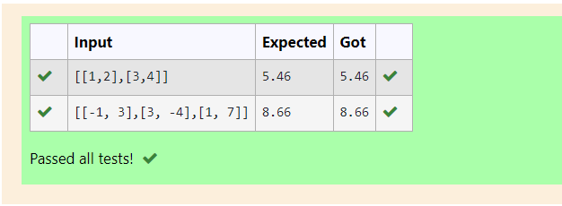

# 2-Norm of a matrix

## Aim
To write a program to find the 2-norm of the matrix and display the result in two decimal places.

## Equipment’s required:
1.	Hardware – PCs
2.	Anaconda – Python 3.7 Installation / Moodle-Code Runner

## Algorithm:

### Step 1:
Get the input matrix using np.array()

### Step 2:
The 2-Norm of a matrix is given by 

    
### Step 3:
Find the 2-norm of the matrix using np.linalg.norm().

### Step 4:
Print the norm of the matrix in two decimal places.

## Program:
```
Program to find 2-norm of a matrix.
Developed by: Vaishnavi M
RegisterNumber: 21500310

import numpy as np
n = eval(input())
val = np.linalg.norm(n,2)
print("{:.2f}".format(val))


```
## Input and Output:



## Result
Thus the program for 2-norm of a matrix is written and verified.
